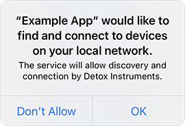

# App Discovery

Detox Instruments uses zero-configuration networking (Bonjour) to discover apps suitable for profiling. This requires no configuration by you under normal circumstances. 

The following resources discuss in detail what zero-configuration networking is:

- [Bonjour (software)](https://en.wikipedia.org/wiki/Bonjour_(software))
- [Bonjour Network Discovery and Connectivity](https://developer.apple.com/videos/play/wwdc2011/211/)

Launching Detox Instruments and starting a new recording, you will be presented with the App selection dialog:

This dialog displays a list of applications which can be profiled by Detox Instruments. The list will populate and update automatically over time, as apps are discovered. Apps running on the same Mac as Detox Instruments will be sorted first, followed by other apps discovered. Enable the **Local only** option to display only local apps.

Select **App Launch** in the pop up menu to profile your app's app launch.

For more information on app launch profiling, see [App Launch Profiling](AppLaunchProfiling.md).

### Troubleshooting

If your app does not appear in the app selection dialog, the following tips will help you troubleshoot.

- Make sure you have integrated your app with the Profiler framework. See [Profiler Framework Integration Guide](XcodeIntegrationGuide.md) for more information

- iOS 14 requires local network permission before allowing the discovery and connection to the Profiler service:

  

  If you haven't allowed this permission, you can enable it in **Settings app > Privacy -> Local Network**:

  

- Devices should be connected on the same network (Wi-Fi, LAN for macOS & Simulators or Lightning cable for direct connection)

- If your app is not running on a simulator on the same Mac as Detox Instruments, make sure the **Local Apps Only** option is disabled

- Security software, such as Antivirus and Firewall applications, may interfere with Bonjour; please consult the software manual or contact your system administrator

- Corporate networks may block or otherwise prevent Bonjour from working; please contact your system administrator
  
  - As a workaround, you can connect your device locally to your Mac using a Lightning cable, which will create a Bonjour-supported direct connection
  
- Under extreme cases, Bonjour may stop working for certain devices. Resetting network settings in **Settings > General > Reset > Reset Network Settings** is known to help
  
  - > **Note:** This will reset all your network settings, including wi-fi passwords, proxy configurations, VPNs, DNS settings, etc. Perform this step with care.
