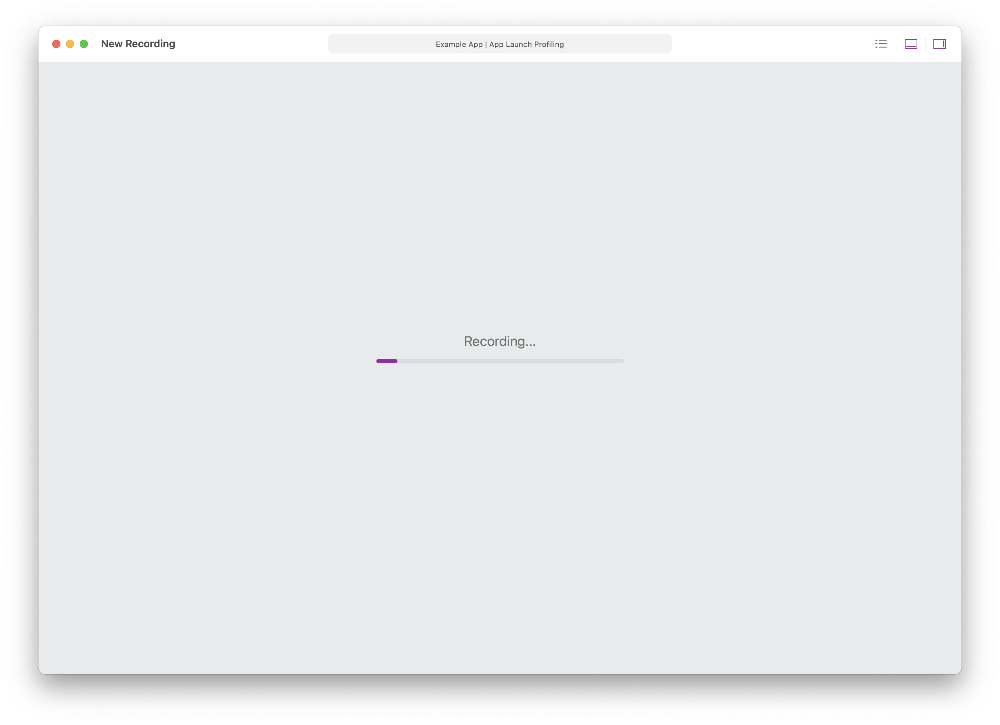

# App Launch Profiling

Detox Instruments allows profiling your app's launch by starting a recording very early on for a set amount of time. This gives you the opportunity to inspect your app's behavior during launch, something that is not easily possible using normal profiling.

You can configure the duration of app launch profiling in the profiling preferences. For more information, see [Profiling Preferences](Preferences_Profiling.md).

To initiate app launch profiling, during [app discovery](AppDiscovery.md) select the **App Launch** option from the pop up button.

Detox Instruments will wait for your app to launch. Your app will notify you that you need to terminate it. Tap the **Terminate** button and launch your app again.

Once your app launches, Detox Instruments will start the recording phase for the duration configured in profiling preferences.

Once recording is finished, Detox Instruments will display the collected data.

