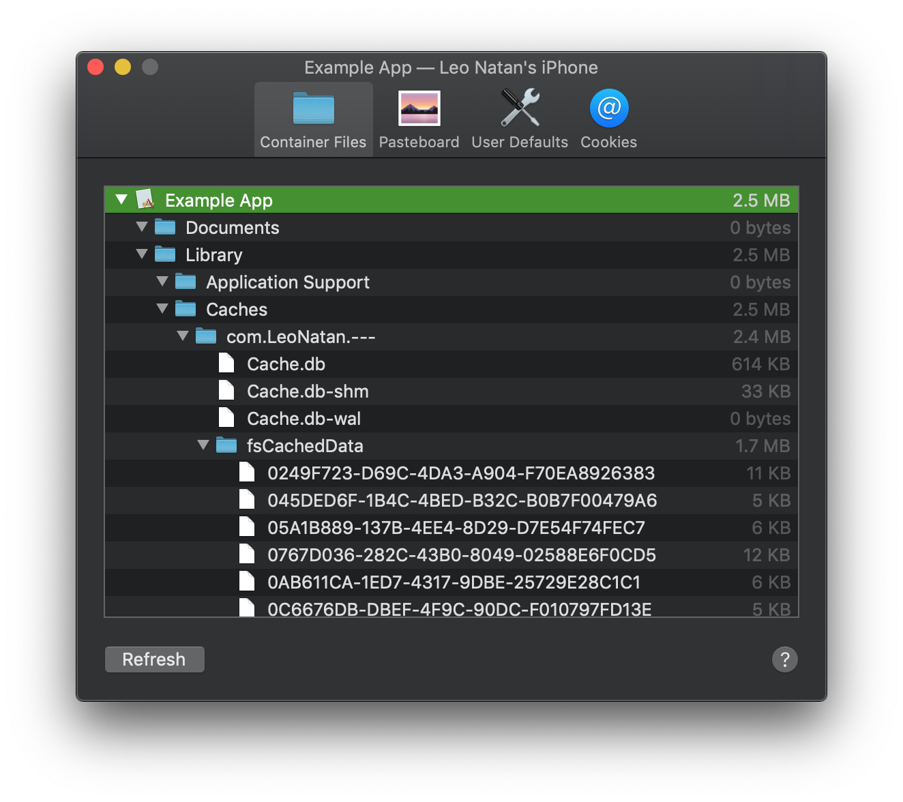
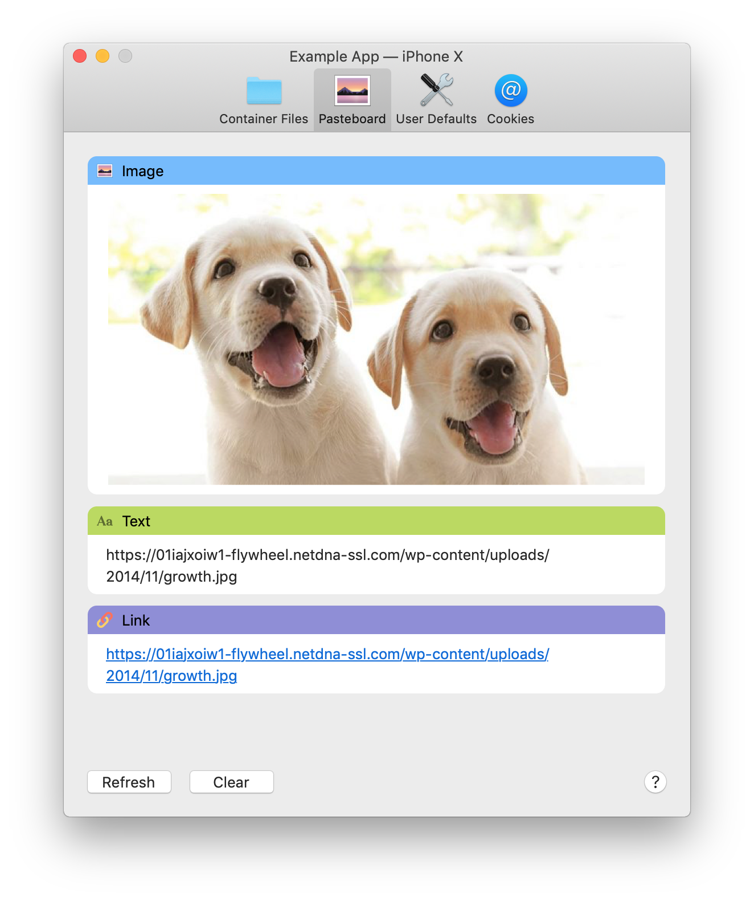
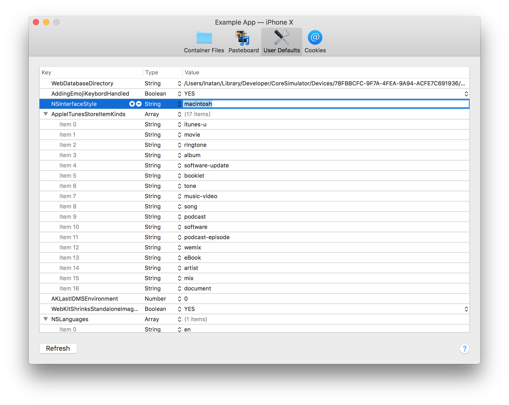
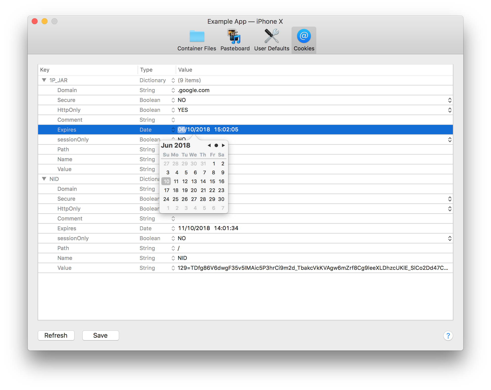

# App Management

Detox Instruments includes a set of app management utilities for managing your app's settings and resources. Use these utilities to share information between your mac and your app on your device. You can manage several apps at the same time and share information between them.

### Container Files

The **Container Files** utility gives you access to the files container inside your app's container, including your app's Document and Library folders. You can download the entire container or specific folders or items , by right-clicking on the desired item and selecting **Download**. You can upload files or folders by dragging them to the correct destination, or pasting them.

### Pasteboard

The **Pasteboard** utility allows full management of your device's general pasteboard. Use this utility to copy pasteboard items between your Mac and your device, or between devices.

The following pasteboard types are currently supported: 

- Text
- Rich Text
- Images
- Links
- Colors

The **Clear** button clears the pasteboard on your device.

### User Defaults

The **User Defaults** utility allows real time access and modification of your app's standard user defaults. All operations are supported, similar to Xcode's property list editor.

### Cookies

The **Cookies** utility allows creating and/or modifying your app's HTTP cookies on your device.

The **Save** button sends your modified cookies to your app.

