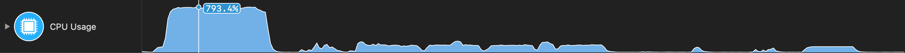
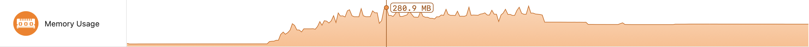
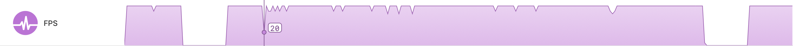
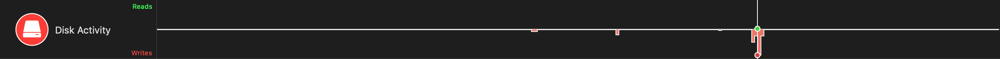
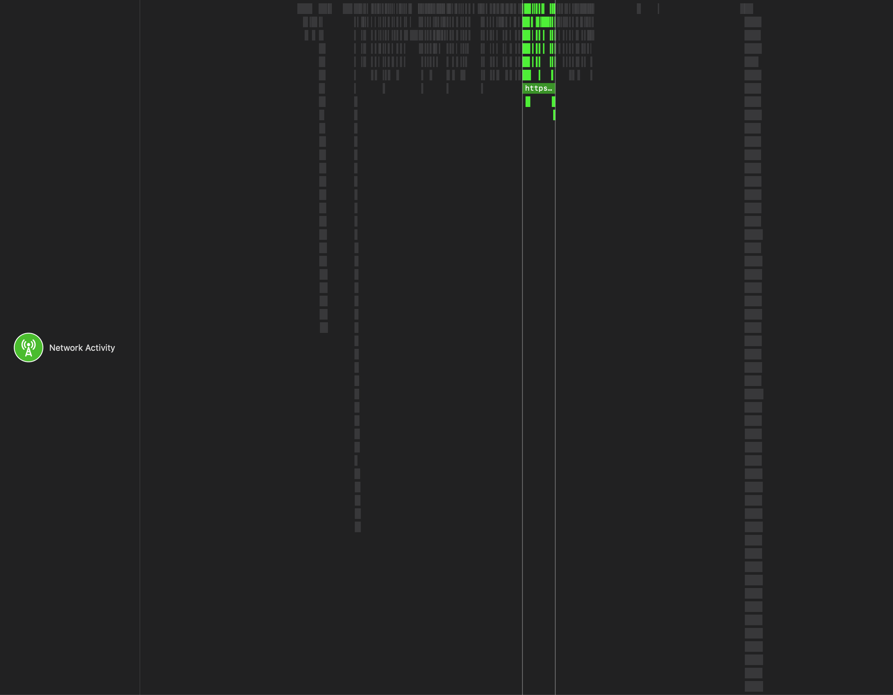
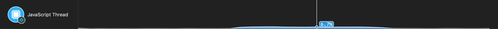
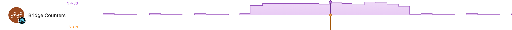
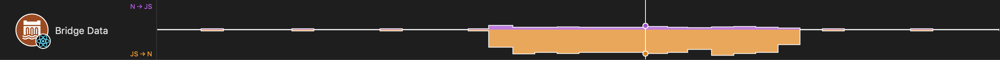

# Available Instruments

Detox Instruments includes many instruments to analyze many aspects of your app.

### CPU Usage

The CPU Usage instrument captures information about the app's load on the CPU. It can record information from multiple threads when the **Record thread information** profiling option is enabled.

For an in-depth look at the CPU Usage instrument, see [CPU Usage Instrument](Instrument_CPUUsage.md).

### Memory Usage

The Memory Usage instrument captures information about your app's memory usage.

For an in-depth look at the Memory Usage instrument, see [Memory Usage Instrument](Instrument_MemoryUsage.md).

### FPS

The FPS instrument captures information about the frame-rate of your app's user interface.

For an in-depth look at the FPS instrument, see [FPS Instrument](Instrument_FPS.md).

### Disk Activity

The Disk Activity instrument captures information about your app's disk reads and writes and open files.

For an in-depth look at the Disk Activity instrument, see [Disk Activity Instrument](Instrument_DiskActivity.md).

### Network Activity

The Network Activity instrument captures information about your app's network activity. It can record localhost information when the **Record localhost network** profiling option is enabled.

For an in-depth look at the Network Activity instrument, see [Network Activity Instrument](Instrument_NetworkActivity.md).

### Events

The Network Activity instrument captures information about your app's network activity. It can record localhost information when the **Record localhost network** profiling option is enabled.

For an in-depth look at the Events instrument, see [Events Instrument](Instrument_Events.md).

### JavaScript Thread

The JavaScript Thread instrument captures information about the CPU load of your app's JavaScript thread.

For an in-depth look at the JavaScript Thread instrument, see [JavaScript Thread Instrument](Instrument_JavaScriptThread.md).

### Bridge Counters

The Bridge Counters instrument captures information about React Native bridge calls made by your app.

For an in-depth look at the Bridge Counters instrument, see [Bridge Counters Instrument](Instrument_BridgeCounters.md).

### Bridge Data

The Bridge Data instrument captures information about React Native bridge data passed in your app.

For an in-depth look at the Bridge Data instrument, see [Bridge Data Instrument](Instrument_BridgeData.md).