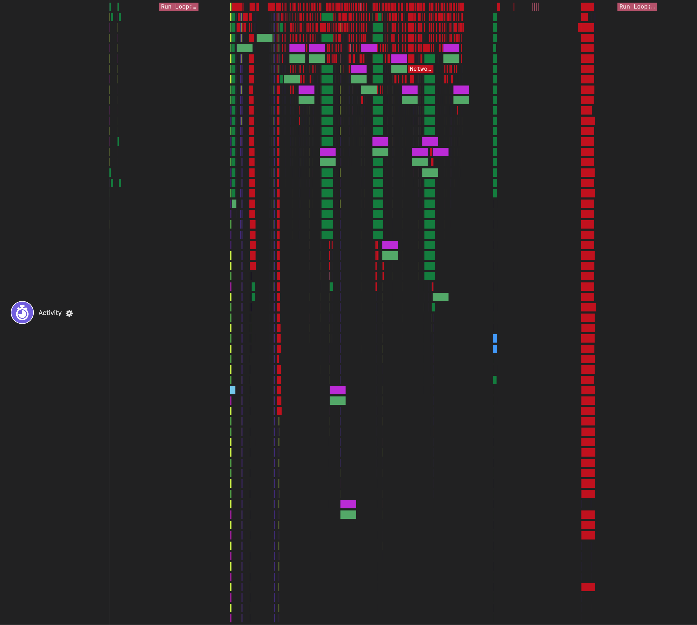
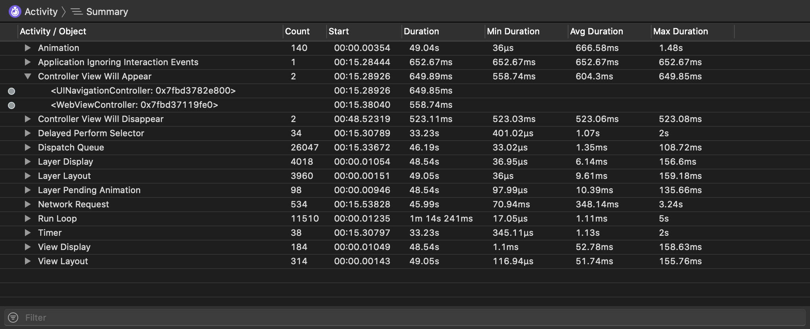
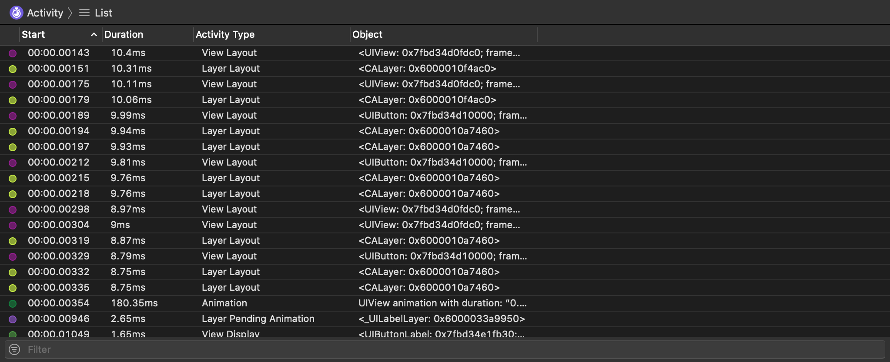
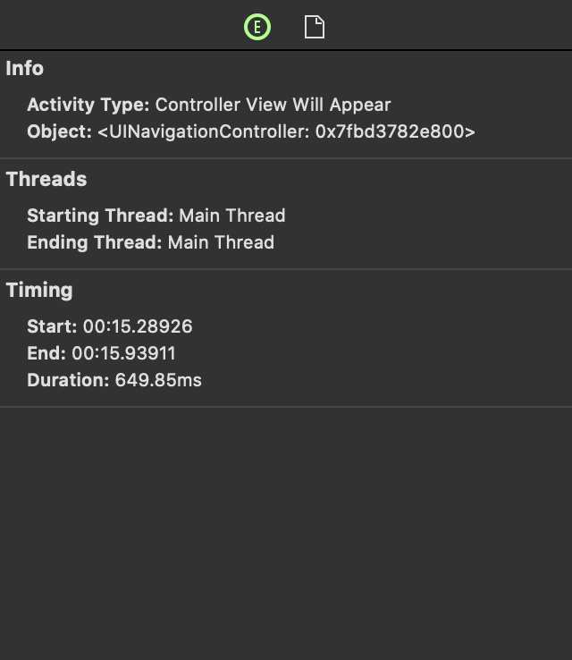

# Activity Instrument

The Activity instrument captures system activity during the app's run time.

### Discussion

Use the information captured by this instrument to inspect system activity in your app and how it correlates to other performance metrics, such as CPU and memory usage.

Each activity type is displayed with its own unique color on the timeline. Each activity sample includes an object information, which helps you better figure out which object initiated the system activity.

The Activity instrument is disabled by default as it records a large amount of data from numerous sources. Enabling it will introduce some performance penalty and recording documents can see a significant size increase.

You can filter which activities are displayed by clicking on the **Options** button ().

### Detail Pane

The detail pane displays all activity types.

From the navigation bar, you can display activity samples in summary or list.

#### Summary

Events will be grouped by categories and their names. For groups, you can see the number of events, the total duration of all events in the group as well as min/avg/max duration.

#### List

Activity samples will be displayed in a list.

### Inspector Pane

For each sample or group, the inspector pane shows information, such as activity type, object or starting and ending threads.

