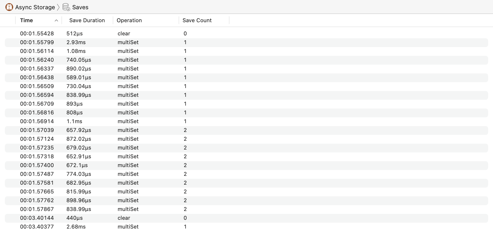
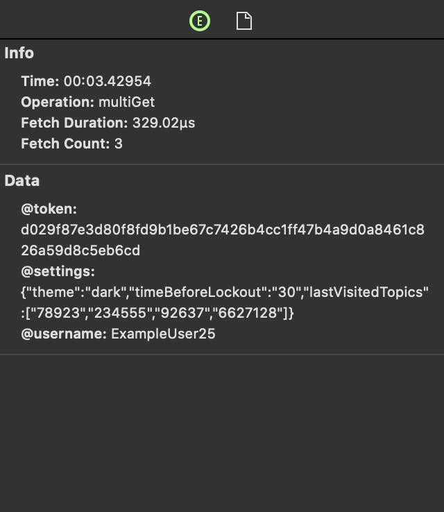

# Async Storage Instrument

The Async Storage instrument captures information about React Native async storage fetches and saves in the profiled app.

### Discussion

Use the information captured by this instrument to inspect async storage fetches and saves. 

If the **Record async storage data** preference was enabled during recording, async storage data captured will appear in the inspector pane. For an in-depth look at the profiling preferences, see [Profiling Preferences](Preferences_Profiling.md).

### Detail Pane

The detail pane displays fetch and save samples, as well as general information about each operation, such as the operation type, duration and count.

#### Fetches

#### Saves

### Inspector

If the **Record async storage data** preference was enabled during recording, async storage data captured will appear in addition to general information.

