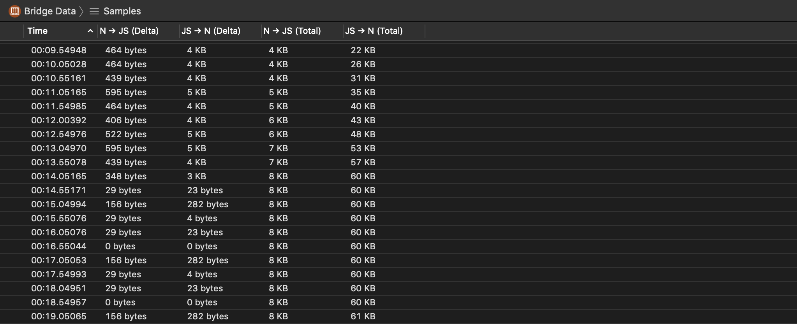
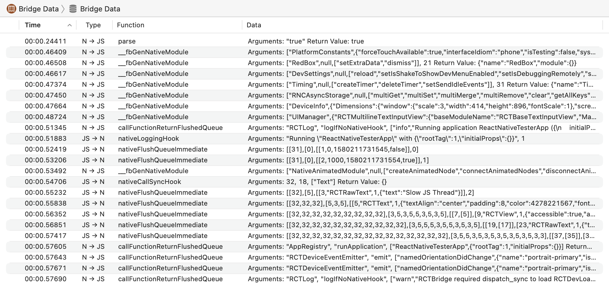
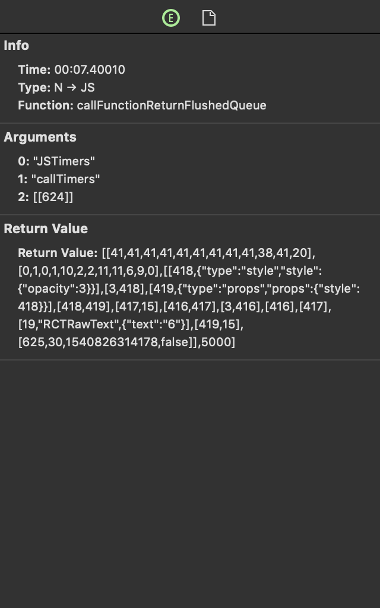

# React Native Bridge Data Instrument

The Bridge Data instrument captures information about React Native bridge data passed in your app.

### Discussion

Use the information captured by this instrument to inspect the data passed in your app's React Native bridge. The more data passed, the more processing needed in native and the JavaScript thread, and thus can lead to your app being less responsive.

### Detail Pane

The detail pane includes your app's React Native bridge data at the time of the sample; N ➔ JS (native to JavaScript) and JS ➔ N (JavaScript to native) are displayed in columns of delta as well as total.

If the **Record bridge data** option was enabled during recording, you can select to view **Samples** or **Bridge Data** in the navigation bar.

For an in-depth look at profiling options, see [Profiling Options](ProfilingOptions.md).

#### Samples

#### Bridge Data

### Inspector

#### Bridge Data

If the **Record bridge data** option was enabled during recording, the inspector pane shows information about React Native bridge data packets.

