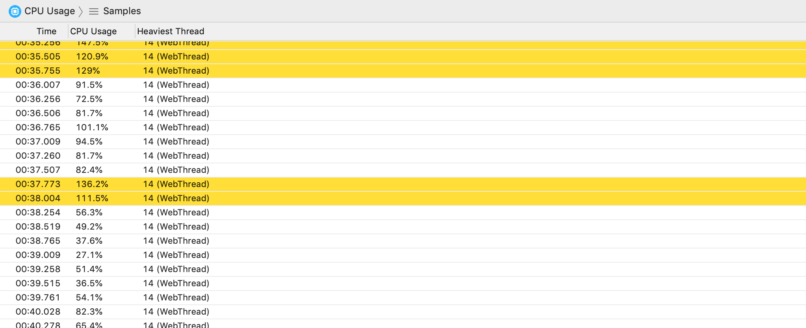
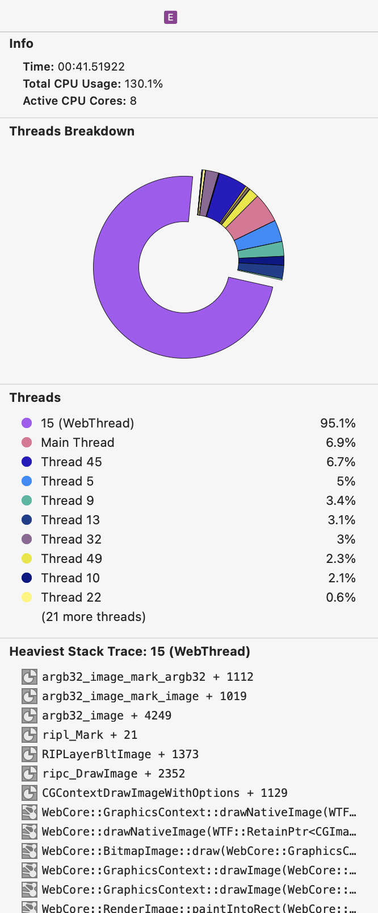

# CPU Usage Instrument

The CPU Usage instrument captures information about the app's load on the CPU. It can record information from multiple threads when the **Record thread information** profiling option is enabled.

Expanding the timeline reveals each thread's CPU load.

### Discussion

Use the information captured by this instrument to inspect your app's general CPU usage, as well as debug CPU peaks and high usage.

Enable the **Record thread information** profiling option to capture information about the threads in your app. Enable the **Collect stack traces** and **Symbolicate stack traces** to collect the heaviest thread's stack trace and symbolicate symbols to assist in debugging of your app's CPU load.

For an in-depth look at profiling options, see [Profiling Options](ProfilingOptions.md).

### Detail Pane

The detail pane includes your app's CPU usage at the time of the sample. If the **Record thread information** profiling option was enabled during recording, the heaviest thread will also be noted for each sample.

Samples will be highlighted in red (warning 3) when:

* The main thread CPU load is above 90%
* The overall CPU load is above 200%

Samples will be highlighted in orange (warning 2) when:

* The main thread CPU load is above 80%
* The overall CPU load is above 150%

Samples will be highlighted in yellow (warning 1) when:

* The main thread CPU load is above 70%
* The overall CPU load is above 100%

### Inspector Pane

For each sample, the inspector pane shows the time of the sample and the CPU usage. If the **Record thread information** profiling option was enabled during recording, the inspector pane will display a threads breakdown pie chart and a list of the most active threads. If the **Collect stack traces** profiling option was enabled during recording, the inspector pane will display the heaviest thread's stack trace.

You can select the one or more stack trace symbols and copy them in a debugging-friendly format for further investigation, symbolication, etc.