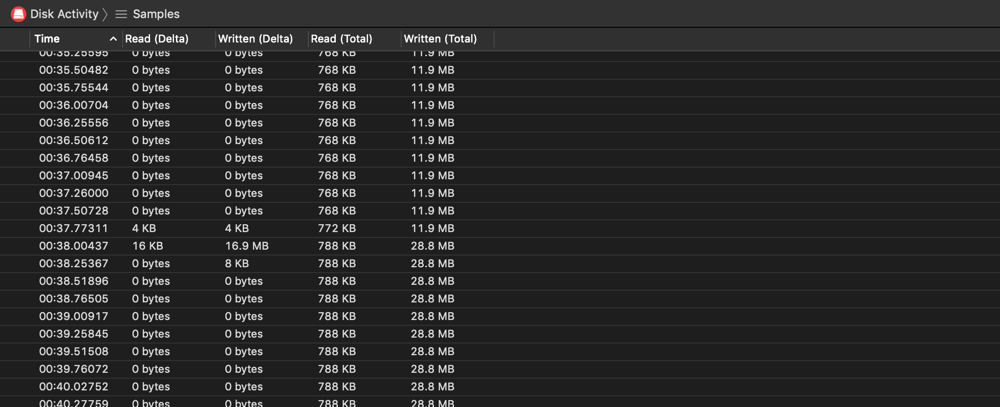

# Disk Activity Instrument

The Disk Activity instrument captures information about your app's disk reads and writes.

### Discussion

Use the information captured by this instrument to inspect your app's general disk activity.

### Detail Pane

The detail pane includes your app's disk activity at the time of the sample; reads and writes are displayed in columns of delta as well as total.

