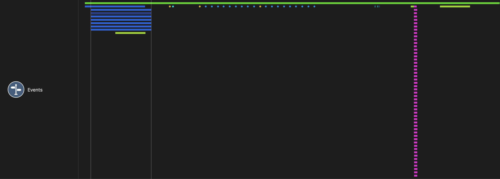
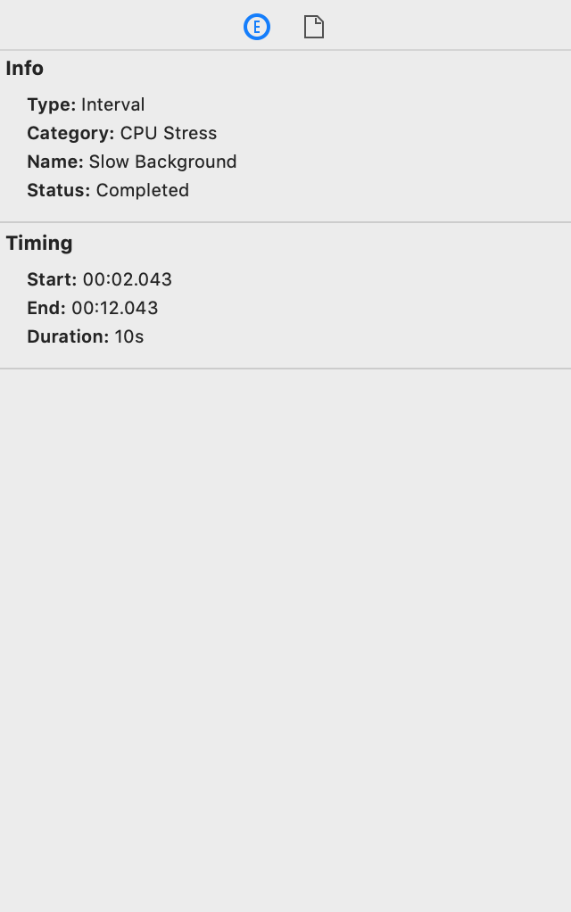

# Events Instrument

The Events instrument lets you add lightweight instrumentation to your code for collection and visualization by Detox Instruments. You can specify interesting periods of time ('intervals') and single points in time ('events'). Each event can be marked as completed or errored, or as 12 different general-purpose categories, each displayed with its own color in the timeline pane.

For more information on developer APIs, see the [Developer API Reference](DeveloperAPIReferenceIntro.md).

### Discussion

Use the information captured by this instrument to inspect events in your app and how they correlate to other performance metrics, such as CPU and memory usage.

Events appear as segmented lines on the timeline in the timeline pane. Multiple concurrent events will appear below each other.

### Detail Pane

The detail pane displays all your events, grouped by categories and their names. For groups, you can see the number of events, the total duration of all events in the group as well as min/avg/max duration.

Samples will be highlighted in red (warning 3) when you set the event status to 'Error'.

### Inspector Pane

For each sample, the inspector pane shows group or event information, such as status, timing and additional information provided by you in the API.

