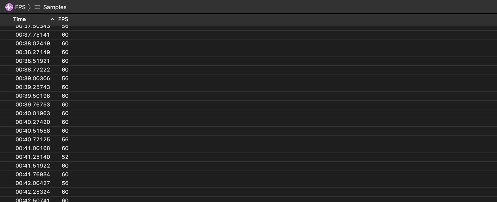

# FPS Instrument

The FPS instrument captures information about the frame-rate of your app's user interface.

### Discussion

Use the information captured by this instrument to inspect your app's general user interface responsiveness. Optimally, your app should sustain a frame-rate of 60 fps and above, when the device allows for it. Use this instrument to find low performing areas of your app. Cross-reference information collected from other instruments, such as the CPU Usage instrument, to better understand why your app is misbehaving.

### Detail Pane

The detail pane includes your app's FPS at the time of the sample.

Samples will be highlighted in red (warning 3) when:

* The FPS is below 15

Samples will be highlighted in orange (warning 2) when:

* The FPS is below 30

Samples will be highlighted in yellow (warning 1) when:

* The FPS is below 45