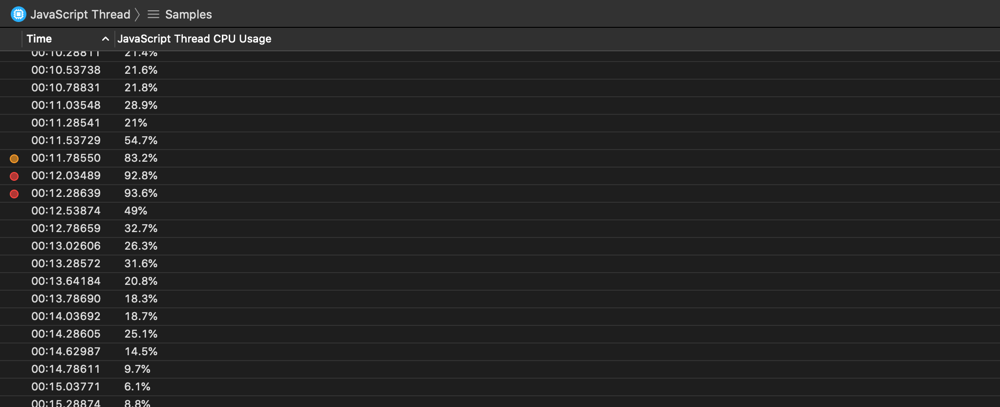

# React Native JavaScript Thread Instrument

The JavaScript Thread instrument captures information about the CPU load of your app's JavaScript thread.

### Discussion

Use the information captured by this instrument to inspect your app's general JavaScript thread CPU usage, as well as debug CPU peaks and high usage.

### Detail Pane

The detail pane includes your app's JavaScript thread CPU usage at the time of the sample.

Samples will be highlighted in red (warning 3) when:

* The JavaScript thread CPU load is above 90%

Samples will be highlighted in orange (warning 2) when:

* The JavaScript thread CPU load is above 80%

Samples will be highlighted in yellow (warning 1) when:

* The JavaScript thread CPU load is above 70%
