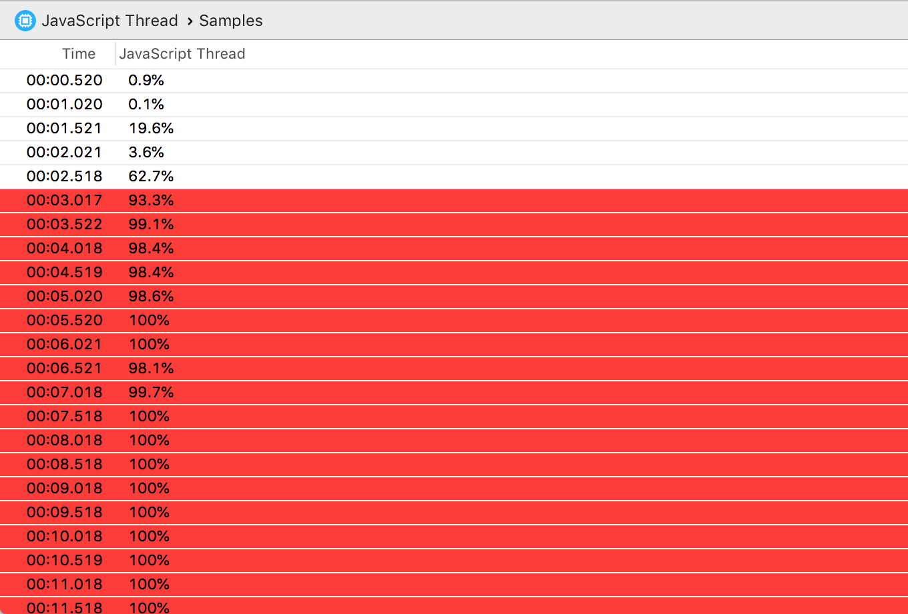
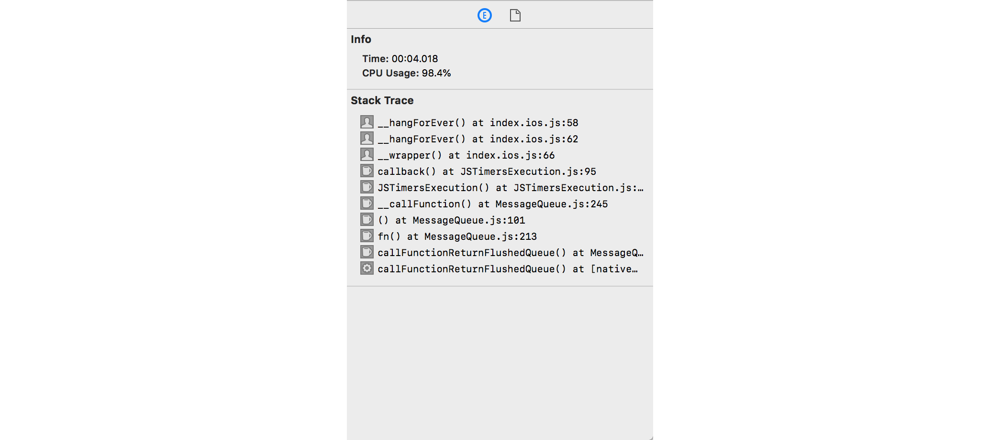

# React Native JavaScript Thread Instrument

The JavaScript Thread instrument captures information about the CPU load of your app's JavaScript thread.

### Discussion

Use the information captured by this instrument to inspect your app's general JavaScript thread CPU usage, as well as debug CPU peaks and high usage.

Enable the **Collect JavaScript stack traces** and **Symbolicate JavaScript stack traces** to collect the stack trace and symbolicate symbols to assist in debugging of your JavaScript thread CPU load.

For an in-depth look at profiling options, see [Profiling Options](ProfilingOptions.md).

### Detail Pane

The detail pane includes your app's JavaScript thread CPU usage at the time of the sample.

Samples will be highlighted in red (warning 3) when:

* The JavaScript thread CPU load is above 90%

Samples will be highlighted in orange (warning 2) when:

* The JavaScript thread CPU load is above 80%

Samples will be highlighted in yellow (warning 1) when:

* The JavaScript thread CPU load is above 70%

### Inspector Pane

For each sample, the inspector pane shows the time of the sample and the CPU usage. If the **Collect JavaScript stack traces** profiling option was enabled during recording, the inspector pane will display the JavaScript thread's stack trace.

You can select the one or more stack trace symbols and copy them in a debugging-friendly format for further investigation.