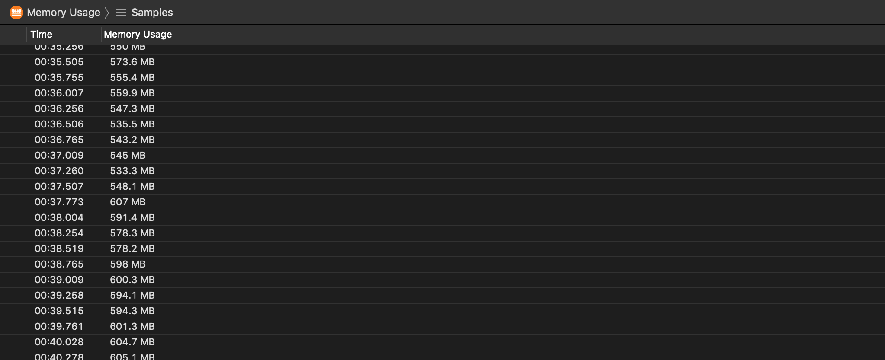

# Memory Usage Instrument

The Memory Usage instrument captures information about your app's memory usage.

### Discussion

Use the information captured by this instrument to inspect your app's general memory usage. Notice memory spikes and steep slopes and investigate if you app is misbehaving.

### Detail Pane

The detail pane includes your app's memory usage at the time of the sample.

