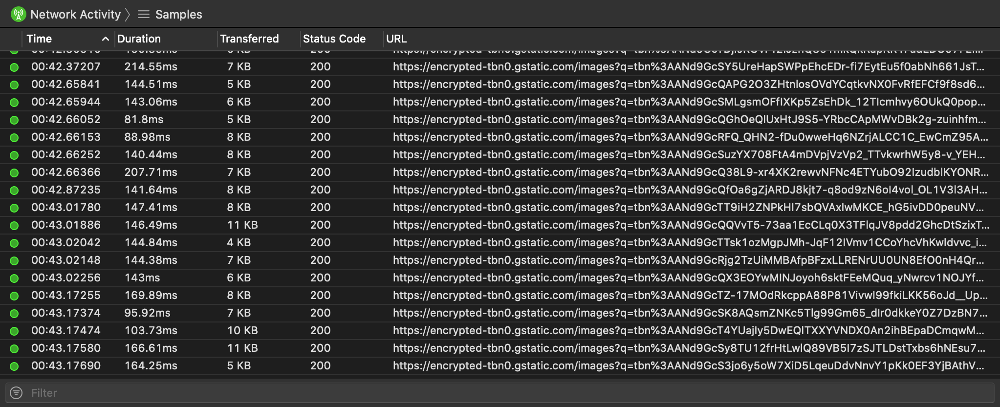
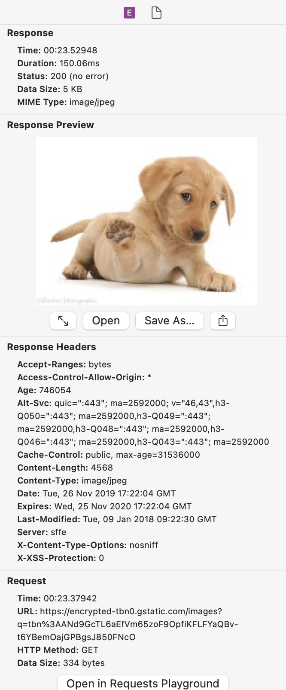

# Network Activity Instrument

The Network Activity instrument captures information about your app's network activity. It can record localhost information when the **Record localhost network** profiling option is enabled.

### Discussion

Use the information captured by this instrument to inspect your app's general network activity.

Network requests appear as segmented lines on the timeline in the timeline pane. Multiple requests made concurrently will appear below each other. Making many concurrent requests may hurt your app's performance.

Enable the **Record localhost network** profiling option to capture requests sent to localhost to further investigate your app's network activity.

For an in-depth look at profiling options, see [Profiling Options](ProfilingOptions.md).

### Detail Pane

The detail pane includes your app's Network Activity at the time of the sample. If the **Record thread information** profiling option was enabled during recording, the heaviest thread will also be noted for each sample.

Samples will be highlighted in red (warning 3) when:

* The request failed with an error

Samples will be highlighted in orange (warning 2) when:

* The response' status code is below 200 or equal to or above 400

Samples will be highlighted in yellow (warning 1) when:

* The request is still pending and no response has been received yet

### Inspector Pane

For each sample, the inspector pane shows request and response information, such as headers, data and general information.

Response data is previewed automatically, and you can save file by right clicking on the preview and selecting **Save As...**

#### Requests Playground

You can open the selected request in the **Requests Playground** utility by clicking the **Open in Requests Playground** button. All the headers and data of the request will be transferred.

For more information, see [Requests Playground](RequestsPlayground.md).