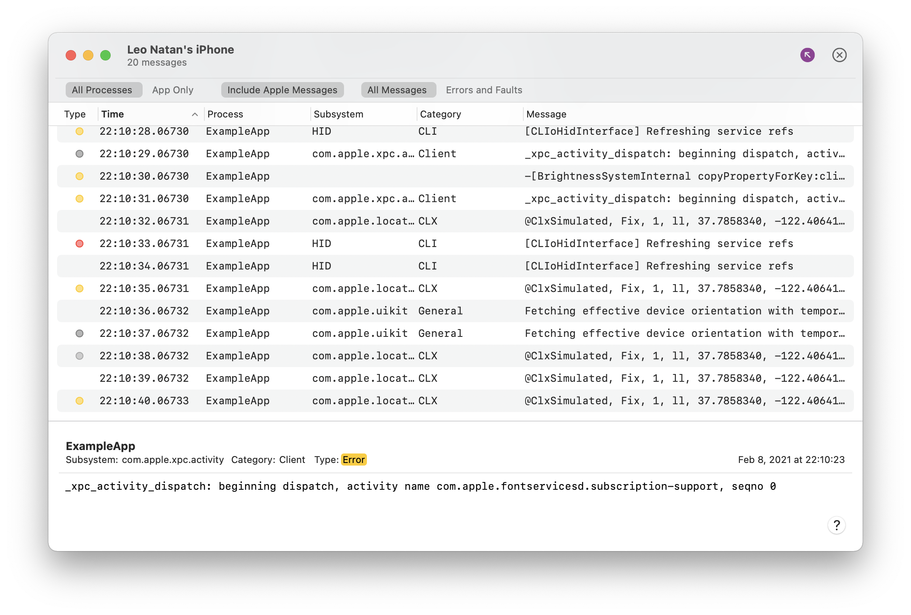

# Live Console

Live Console collects log messages that are generated from your app and device, and you can use these messages to check on your app’s performance and solve problems.

The log messages collected will start appearing in real time in the Live Console window.

To follow new messages as they are added, enable the Now Mode button (). To clear all existing messages, click the Clear button ().

In the favorites bar, you can choose whether to display messages from all process or only your app’s, whether to include messages from Apple frameworks and whether to display all messages, or only errors and faults.

The type of log message is indicated by a colored dot in the Type column:

- Red : Faults
- Yellow : Errors
- Dark gray : Debug log messages
- Light gray : Info log messages

Note: If there is no colored dot in the Type column, the log message is the default type.

