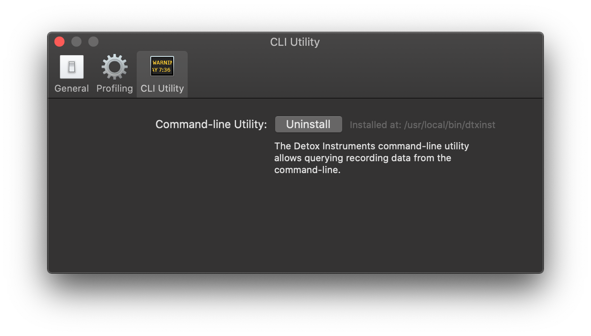

# CLI Preferences

Use the CLI preferences to manage the Detox Instruments CLI tool.

From this screen, you can install or uninstall the CLI tool and make it available in your command-line sessions.

For more information on the CLI tool, install it and see `dtxinst --help`.

