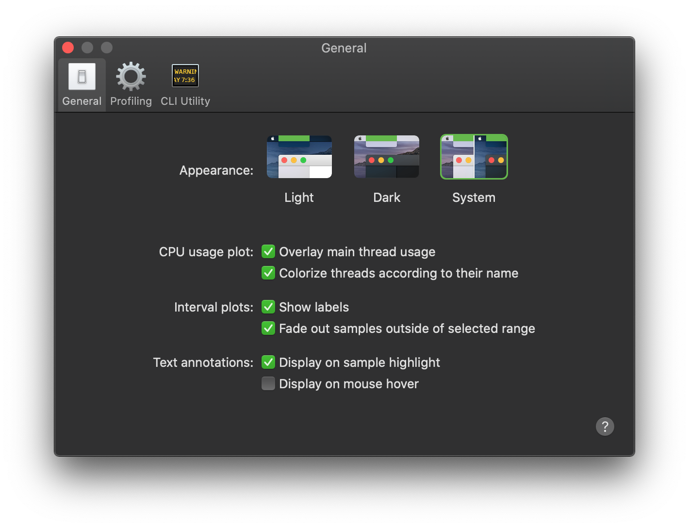

# General Preferences

Use the General preferences to manage the appearance and behavior of Detox Instruments.

### Appearance

Use these preferences to control how the app looks.

The **System** preference lets the app pick its appearance according to the current system appearance.

The **Light** and **Dark** appearance preferences will force the app to appear in the selected appearance, regardless of the system appearance.

### CPU Usage Plot

The **Overlay main thread usage** preference controls whether the main thread CPU usage portion is overlaid on top of the general CPU usage plot.

The **Colorize threads according to their name** preference controls whether each thread CPU usage plot should be colorized with a color derived from its name, or use the general CPU usage plot color.

### Interval Plots

The **Show labels** preference controls whether interval plots, such as the network or events plots, should display the interval value label in the plot.

The **Fade out samples outside of selected range** preference controls whether samples outside of the selected interval range should be faded out.

### Text Annotations

The **Display on sample highlight** preference controls whether text annotations should be shown on sample highlight.

The **Display on mouse hover** preference controls whether text annotations should be shown on mouse hover over the plot.
