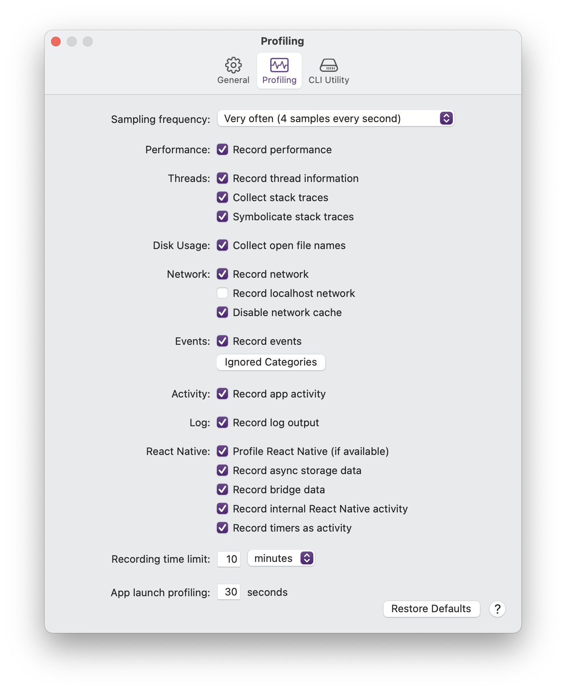
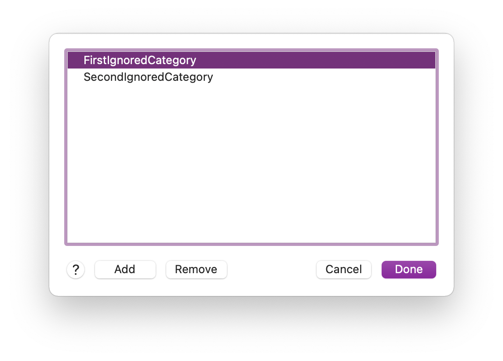

# Profiling Preferences

Before profiling, you can set preferences that change how the profiling performs and what should be recorded. These preferences control the accuracy and amount of data collected at the expense of potential performance impact.

To open the Profiling preferences, select **Detox Instruments** ➔ **Preferences**, and select the **Profiling** tab. 

### Sampling Frequency

The **Sampling frequency** preference configures how many samples should be collected every second. The more samples collected, the more accurate the profiling, at some expense of performance.

It is recommended to start with the default value and only increase sampling frequency if necessary.

### Performance

The **Record performance** preference controls whether performance samples are collected during profiling. Disable this if you want to focus on other instruments, such as network, events or React Native profiling.

### Threads

The **Record thread information** preference controls whether any thread information is recorded during profiling. Recording thread information can provide additional performance metrics per thread. Normally, recording thread information is not an expensive operation and should be enabled unless absolutely not needed.

The **Collect stack traces** preference enables the recording of the stack trace of the heaviest thread. This provides code symbol information for additional debugging purposes. This is a relatively inexpensive operation, but depending on the sampling frequency, may have a slight performance cost.

The **Symbolicate stack traces** preference enables the runtime symbolication of symbols collected in stack traces. This further assists development by creating human-readable symbols. This is a relatively inexpensive operation, but depending on the sampling frequency, may have a slight performance cost.

### Disk Usage

The **Collect open file names** preference enables the collection of names of files open in the app at the time of sampling. This is a relatively inexpensive operation, but depending on the sampling frequency, may have a slight performance cost.

### Network

The **Record network** preference controls whether any network traffic is recorded, including headers and data. Depending on your app's activity, this can take a small-to-moderate toll on performance. If network recording is not necessary, you can turn this preference off to save performance.

The **Record localhost network** preference extends the network recording to localhost connections as well. Depending on your app's activity, this may introduce a lot of unwanted noise. Enable if you need to profile or debug localhost connections.

The **Disable network cache** preference controls whether network cache should be disabled for requests the app makes while recording.

### Events

The **Record events** preference controls whether any events are recorded during profiling.

The **Ignored Categories** button presents the **Ignored Events Categories** sheet.

In this screen, you can add Events categories that will be ignored when recording. Use this to save performance and lower clutter. For an in-depth look at the Events instrument, see [Events Instrument](Instrument_Events.md).

### Activity

The **Record app activity** preference controls whether activity events are recorded during profiling.

For an in-depth look at the Events instrument, see [Activity Instrument](Instrument_Activity.md).

### Log

The **Collect log output** preference enables the recording of your app's log output. This can be very useful for cross-referencing your debug log output with profiling samples of your app. This is an inexpensive operation, but depending on the log output amount, may have a slight performance cost.

### React Native

The **Profile React Native (if available)** preference controls the React Native profiling systems in Detox Instruments and its Profiler framework. These systems provide information such as JavaScript thread performance, bridge calls and bridge data, which can be very helpful when debugging apps with React Native usage.

The **Record bridge data** preference controls whether React Native bridge data is recorded during profiling. Depending on your app's activity, this can take a small-to-moderate toll on performance. If bridge data recording is not necessary, you can turn this preference off to save performance.

The **Record timers as events** preference controls whether React Native timers, created in JavaScript using `setTimeout()`, should be recorded as events and displayed in the Events instrument. This preference requires that the **`detox-instruments-react-native-utils`** package be installed in your React Native app. For more information, see [Events API Reference for React Native / JavaScript](DeveloperAPIReferenceEventsJS.md).

The **Record internal React Native events** preference controls whether internal React Native events are enabled and recorded. Use these events when you want to have insight on the internal working and performance of React Native.

### Time Limit

The **Time limit** preference sets a hard time limit on recording duration. You can set the value in seconds, minutes or hours. The default is 2 minutes.

### App Launch Profiling

The **App launch profiling** preference sets the duration, in seconds, to profile app launches. The default is 15 seconds.

### Restoring Defaults

The **Restore Defaults** button resets all profiling preferences to their default value. These defaults may change from time to time, depending on development and feedback considerations.