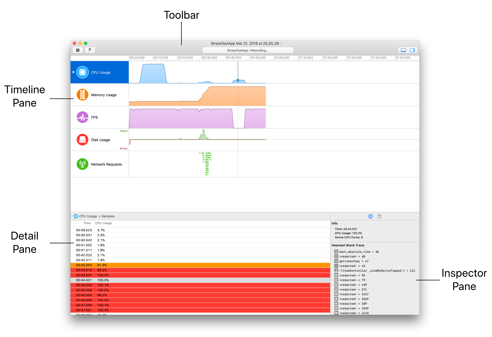
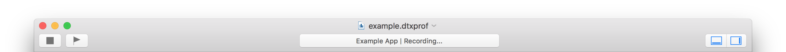
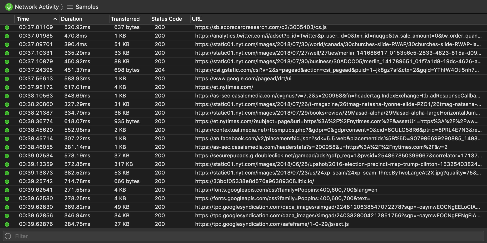
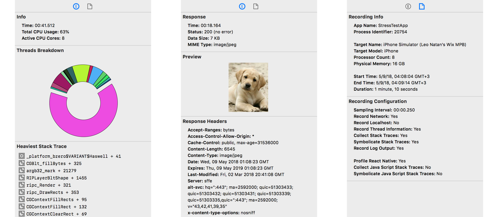

# The Recording Document

A recording document is used to initiate new profiling and view and analyze the results of profiling. You create a new recording document by selecting **File** ➔ **New Recording...** and choosing an app-device pair to profile. You can also save and reopen recording documents in which you’ve collected data previously. A recording document can contain a lot of extremely detailed information, and this information is presented to you through a number of panes and areas.

### Toolbar

The toolbar allows you to stop data profiling, add flags to the recording, display information about the current recording, hide and show panes, and more.

It includes the following main elements:

* **Profiling controls:** Allow you to stop data collection and add a flag
* **Activity viewer:** Shows information about the current recording document
* **Customization button:** Customize the list of visible instruments in the timeline pane.
* **View buttons:** Hide or show the detail pane and inspector.

### Timeline Pane

The timeline pane displays a graphical summary of the data recorded for a given recording. In this pane, each instrument has its own “track,” which provides a graphical chart of the data collected.

The most prominent portion of a trace document is the timeline pane, which presents a time-based view of the data gathered by each instrument. This pane makes it easy to spot trends and potential problem areas in your app at a glance. For example, a sharp rise in the Memory Usage instrument graph may indicate a that your app created more objects or memory buffers than you anticipated. The Network Activity instrument graph displays a timeline of network requests made. If too many requests are created concurrently, this may indicate that your app has scheduling problems.

You can scroll through data using your trackpad, mouse or simply dragging the timeline view. You can zoom in and out by pinching your trackpad or pressing **⌘+** / **⌘−**. Select **View** ➔ **Fit All Recorded Data** or press **⌃⌘Z** to fit all recorded data in the timeline.

Clicking on any point in the timeline will select the closest recorded data sample. The same sample will be selected in the detail pane and additional information will be displayed in the inspector pane under **Extended Detail**.

### Detail Pane

The detail pane displays the data associated with the current recording for the selected instrument. Detox Instruments displays only one instrument at a time in the detail pane, so you must select different instruments to see different sets of details.

The navigation bar at the top of the detail pane displays the icon of the currently selected instrument and the detail type list. You can switch between the instrument data and the console output by clicking the icon view and selecting **Console**.

The collected data area shows you all of the data for the selected instrument, typically in tabular format. The content displayed here varies significantly from instrument to instrument. For example, the CPU instrument displays usage and thread information while the network instrument displays network requests.

Some select instruments, as well as the console view, display a filter field at the bottom, allowing you to filter collected data for a specific term.

### Inspector Pane

This pane contains instrument-specific additional information that may be useful when browsing through data in the detail pane, as well as additional information about the recording document.

##### Extended Detail

For some instruments, the extended detail area in the inspector pane shows additional information about the sample currently selected in the detail pane. This extended detail information can include a description, the time when the information was recorded, a stack trace for a sample from the CPU instrument or response and request data for a Network Activity sample.

##### Recording Info

The recording info area includes information about the recording and the profiling options which were used for the recording.

### Touch Bar

The Touch Bar displays a single instrument at a time and can be used as input for sample selection.

Tap the **Select Instrument** button to select which instrument is displayed.

### Saving a Recording Document

Once you’ve profiles your app and created a recording document, you can save it for later reference. Detox Instruments saves recording documents as Detox Instruments recording files with the .dtxprof extension.

Choose **File** ➔ **Save**. Or, choose **File** ➔ **Duplicate** if you want to save a previously saved recording document as a new file. Name the file and click on the **Save** button.