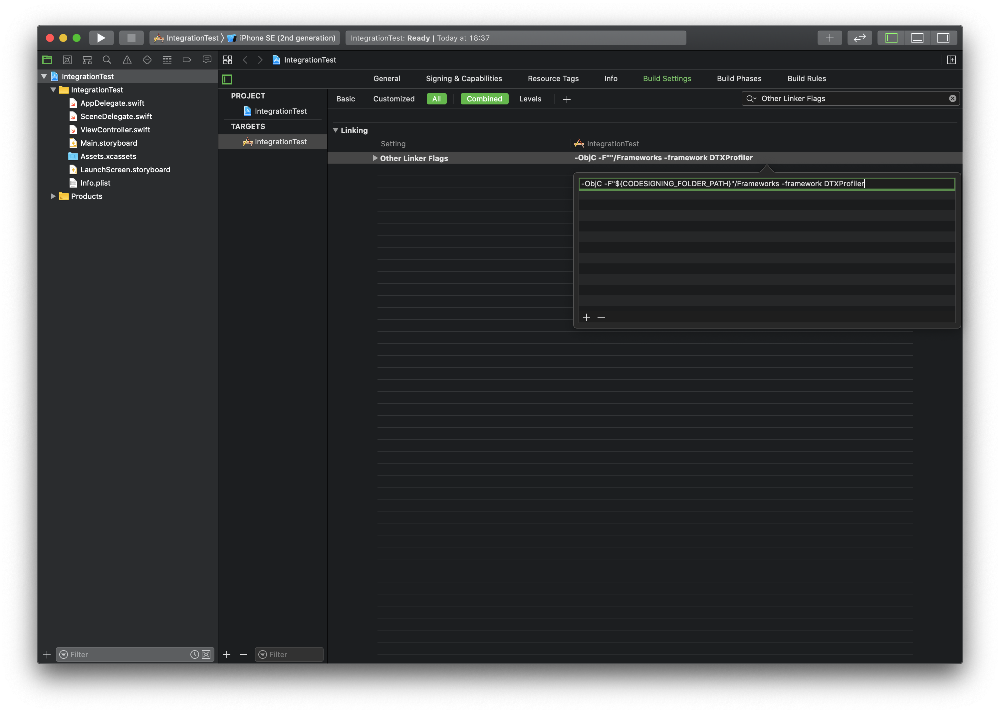
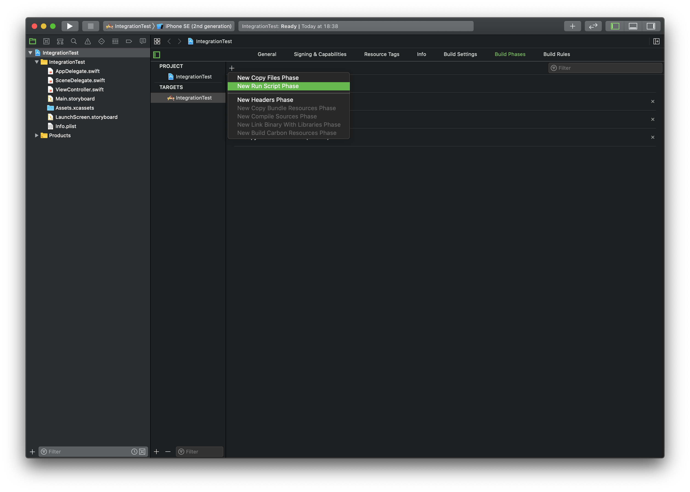
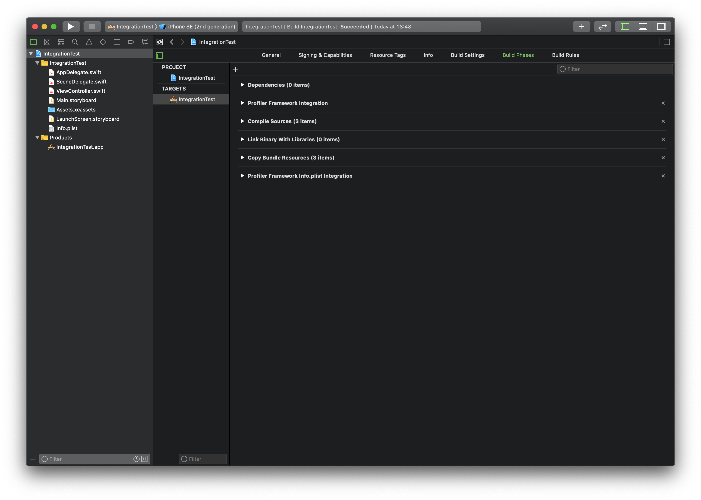
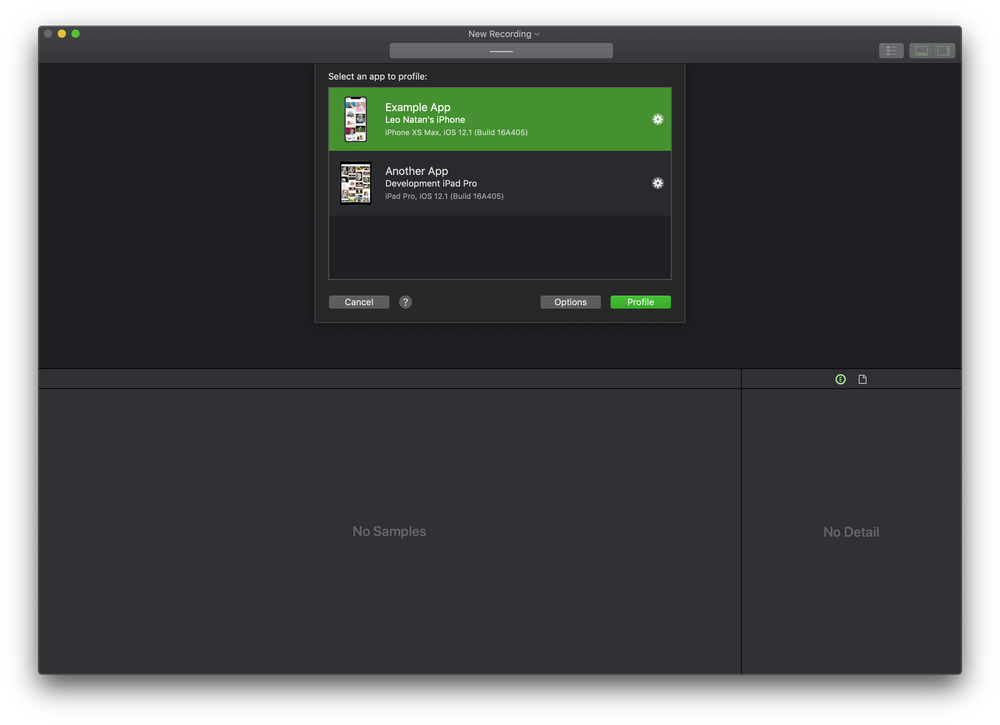

# Profiler Framework Integration Guide with Xcode

The following steps explain how to link the Profiler framework into your iOS application, providing a quick and easy way to enable profiling of your application.

> **WARNING:** Never submit a product which has been linked with the Profiler framework to the App Store. The instructions below outline a way to use build configurations to isolate linking the framework to Debug builds only. You can customize this to allow profiling of other configurations, but be careful.

You'll need to perform the following steps for each target that you wish to integrate:

1. Before starting the integration process, ensure that Detox Instruments has been installed using Homebrew Cask, as explained in the README document.

2. Open your project in Xcode, then select the project's icon in Xcode's Project Navigator.

3. Select the target you want to profile from the **TARGETS** list.

4. Select the **Build Settings** tab and add the following to **Other Linker Flags** (`OTHER_LDFLAGS`) setting for **all configurations**:

	```bash
	-ObjC -F"${CODESIGNING_FOLDER_PATH}"/Frameworks -framework DTXProfiler
	```

	> Add this build setting to additional configurations if you wish to profile them.

	

5. Select the **Build Phases** tab and add a **New Run Script Phase**—name it “Profiler Framework Integration”. Make sure to **uncheck “Based on dependency analysis”** under “Run script”.

	

	Paste in the following shell script:

	```bash
	# Only integrate the framework for the Debug configuration by default. Edit this section to integrate with additional configurations. For example, to add the "Debug_Another" and "Release" configurations, set the following line to:
	#       ALLOWED_CONFIGURATIONS="Debug,Debug_Another,Release"
	ALLOWED_CONFIGURATIONS="Debug"

	# Leave this section empty to dynamically determine the path of the Detox Instruments app. If you are seeing issues, point explicitly to the app here.
	EXPLICIT_INSTRUMENTS_APP_PATH=

	if [ -z "$EXPLICIT_INSTRUMENTS_APP_PATH" ]; then
	  # Find where the Detox Instruments app is installed
	  INSTRUMENTS_APP_PATH=$(mdfind kMDItemCFBundleIdentifier="com.wix.DetoxInstruments" | head -n 1)
	else
	  INSTRUMENTS_APP_PATH="$EXPLICIT_INSTRUMENTS_APP_PATH"
	fi
	PROFILER_BUILD_SCRIPT_PATH="${INSTRUMENTS_APP_PATH}/Contents/SharedSupport/Scripts/profiler_build_phase.sh"
	if [ "${INSTRUMENTS_APP_PATH}" -a -e "${PROFILER_BUILD_SCRIPT_PATH}" ]; then
	  echo Found integration script at "${PROFILER_BUILD_SCRIPT_PATH}"
	  # Run the Profiler framework integration script
	  "${PROFILER_BUILD_SCRIPT_PATH}" "${CONFIGURATION}" "${ALLOWED_CONFIGURATIONS}"
	else
	  echo "Profiler not included: Cannot find an installed Detox Instruments app."
	fi
	```
  
	This script copies the Profiler framework inside your app's bundle when building using the specified configurations.

6. Drag the “Profiler Framework Integration” script phase **above** the “Compile Sources” phase.

  

7. **iOS 14 requires an additional step.** Add a **New Run Script Phase**—name it “Profiler Framework Info.plist Integration”. Make sure to **uncheck “Based on dependency analysis”** under “Run script”. 

  Paste in the following shell script:

  ```bash
  # Only integrate the framework for the Debug configuration by default. Edit this section to integrate with additional configurations. For example, to add the "Debug_Another" and "Release" configurations, set the following line to:
  #       ALLOWED_CONFIGURATIONS="Debug,Debug_Another,Release"
  ALLOWED_CONFIGURATIONS="Debug"
  
  # Leave this section empty to dynamically determine the path of the Detox Instruments app. If you are seeing issues, point explicitly to the app here.
  EXPLICIT_INSTRUMENTS_APP_PATH=
  
  if [ -z "$EXPLICIT_INSTRUMENTS_APP_PATH" ]; then
    # Find where the Detox Instruments app is installed
    INSTRUMENTS_APP_PATH=$(mdfind kMDItemCFBundleIdentifier="com.wix.DetoxInstruments" | head -n 1)
  else
    INSTRUMENTS_APP_PATH="$EXPLICIT_INSTRUMENTS_APP_PATH"
  fi
  PROFILER_BUILD_SCRIPT_PATH="${INSTRUMENTS_APP_PATH}/Contents/SharedSupport/Scripts/profiler_info_plist_phase.sh"
  if [ "${INSTRUMENTS_APP_PATH}" -a -e "${PROFILER_BUILD_SCRIPT_PATH}" ]; then
    echo Found integration script at "${PROFILER_BUILD_SCRIPT_PATH}"
    # Run the Profiler framework integration script
    "${PROFILER_BUILD_SCRIPT_PATH}" "${CONFIGURATION}" "${ALLOWED_CONFIGURATIONS}"
  else
    echo "Profiler not included: Cannot find an installed Detox Instruments app."
  fi
  ```

  This script adds needed keys into app's Info.plist when building using the specified configurations.

8. Drag the “Profiler Framework Info.plist Integration” script phase **below** the “Copy Bundle Resources” phase.

  

9. In Xcode, build and run your application using a scheme that is set to use the **Debug** configuration. If you are running your application on a device, ensure that it is on the same Wi-Fi network as the Mac running Detox Instruments or the device is connected to the Mac with a USB cable.

  If everything worked correctly, you should be able to see your application listed in Detox Instruments. Select your app to start profiling.

  

10. Run your application again, this time using a scheme set to use the **Release** configuration. Verify that Detox Instruments cannot connect to your application. If you can still connect, make sure the Release configuration is not present under the **ALLOWED_CONFIGURATIONS** in the integration script (step 5).
