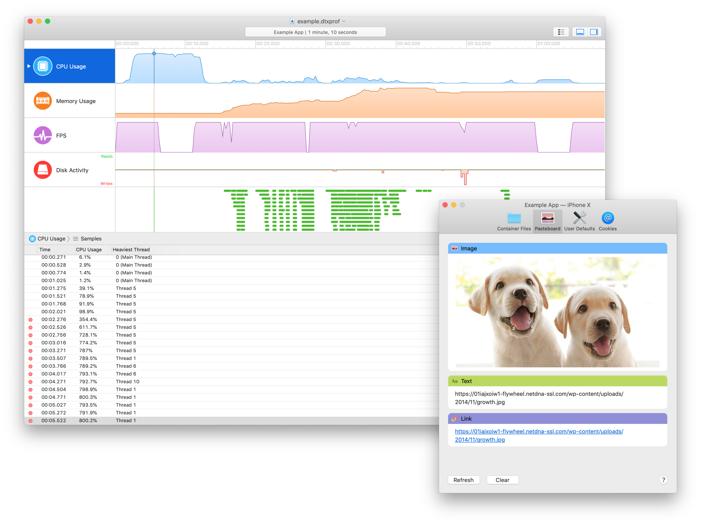
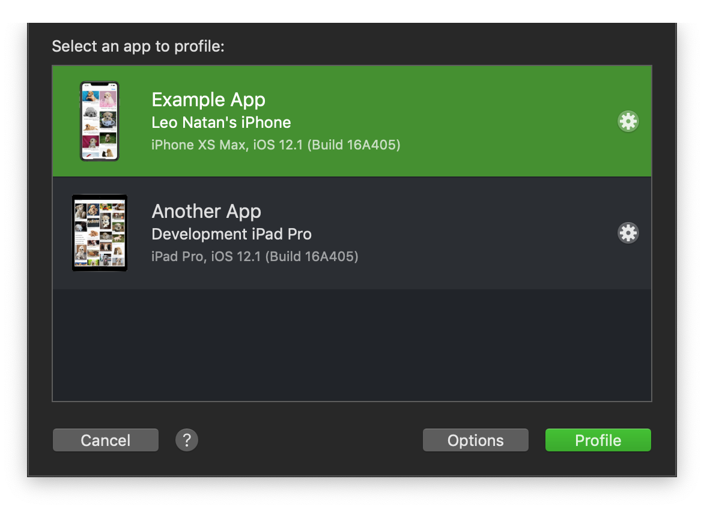
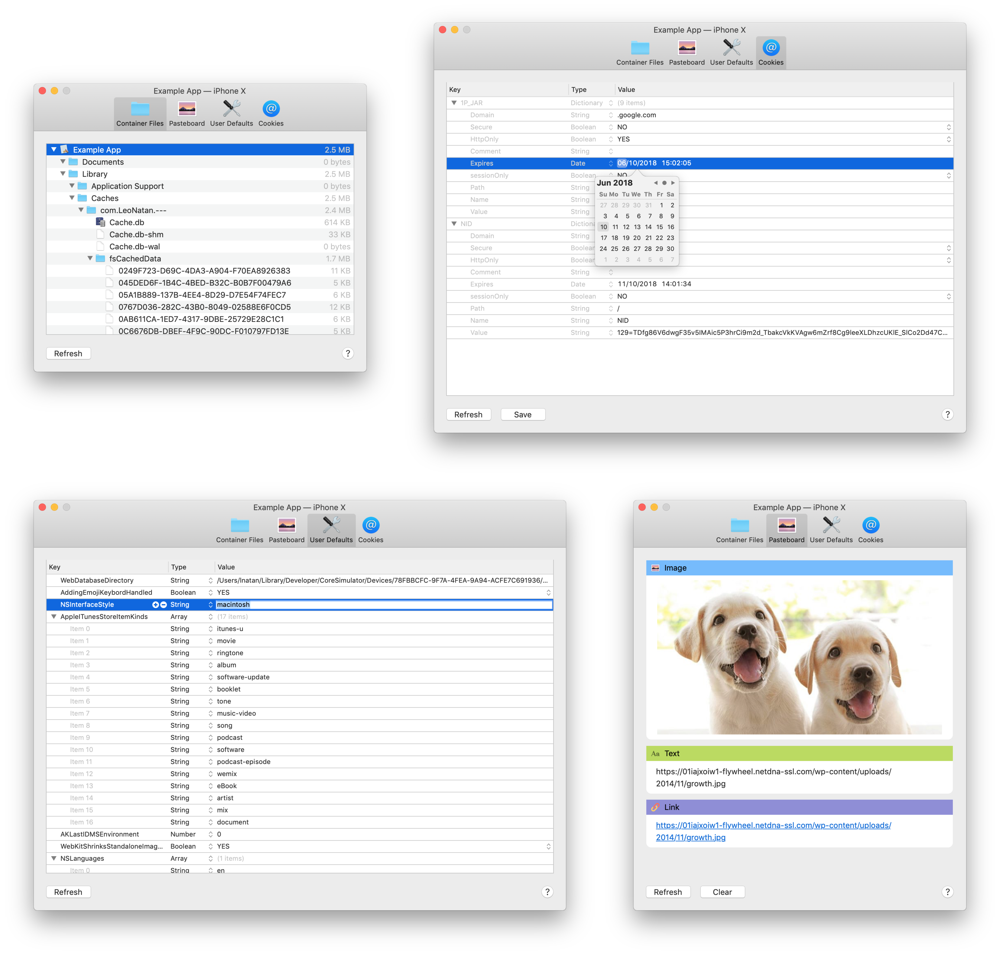
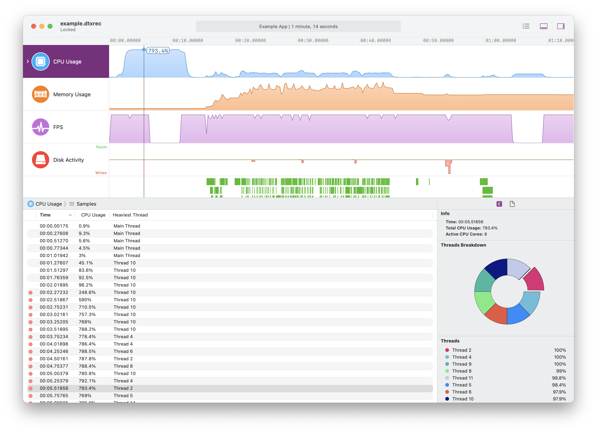
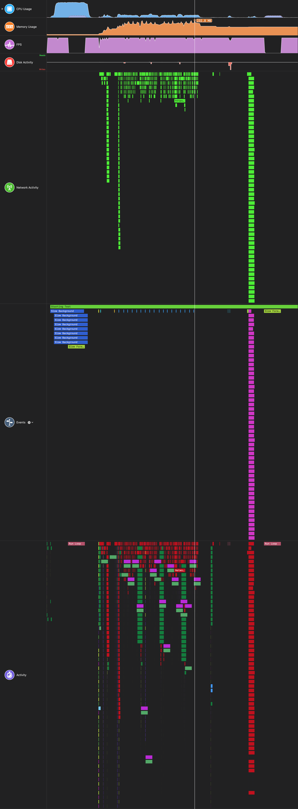
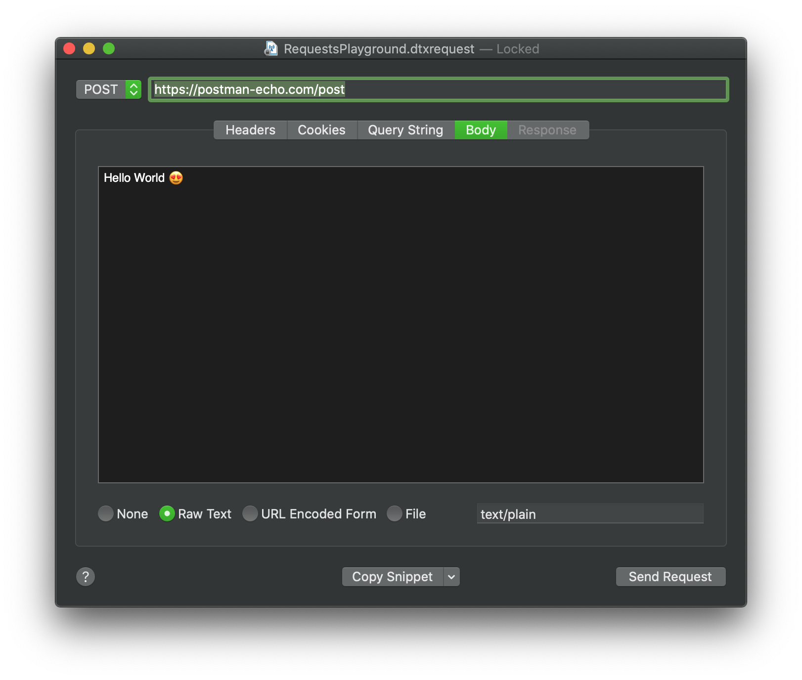

# Detox Instruments

## About

Detox Instruments is a performance–analysis and testing framework, designed to help developers profile their mobile apps in order to better understand and optimize their app's behavior and performance. In addition, Detox Instruments includes utilities for managing your app's resources, such user defaults, pasteboard, cookies, etc.



Incorporating Detox Instruments into the development workflow from the beginning of the app development process can save time later by helping find issues early in the development cycle. Detox Instruments has first–class support for React Native, allowing seamless analysis of the entire app lifecycle in one place.

Detox Instruments supports profiling the following metrics:

* Performance profiling
  * CPU load
  	* Per-thread breakdown of CPU load
  	* Heaviest stack trace sampling
  	* Automatic runtime symbolication of stack traces
  * Memory usage
  * User interface FPS (frames per second)
  * Disk activity (reads and writes, open file names)
* Network activity
  * Full request & response header and data collection and inspection
* Developer events
* React Native profiling
  * JavaScript thread CPU load
  * Bridge call counters
  * Bridge data counters
  * Bridge data collection
  * Async storage metrics & data
* Log output recording

For a list of available instruments and their description, see [Available Instruments](Documentation/AvailableInstruments.md).

Detox Instruments includes the following app management utilities:

- Container files
  - Download and upload files and folders to your app's container
- Pasteboard
  - Copy and paste items between your Mac and your device
- User defaults
  - Modify user defaults in real time
- Cookies
  - Create and modify the app's HTTP cookies
- Async storage (React Native only)
  - Modify the async storage store in real time

For a detailed overview, see [App Management](Documentation/AppManagement.md).

## Installation

The Detox Instruments application requires macOS 10.14 (Mojave) and higher. The Profiler framework supports iOS 10 and higher.

Detox Instruments is installed using Homebrew Cask, by running the following commands:

```bash
brew tap wix/brew
brew cask install detox-instruments
```

This will install Detox Instruments under `/Applications`.

## Integration with Your App's Project

In order to begin profiling your app, you need to integrate the Profiler framework in your app's project. See [Profiler Framework Integration Guide](Documentation/XcodeIntegrationGuide.md) for more information.

### Developer API Reference

By integrating Detox Instruments in your app, many of the included instruments can automatically collect data. Some instruments require you to explicitly call the provided APIs so that specific data can be collected.

For an in-depth look at app management, see [App Management](Documentation/AppManagement.md).

## Profiling an App

Once you've installed Detox Instruments and integrated the Profiler framework with your app's project, you can start profiling your app.

### The App Selection Dialog

After launching Detox Instruments or selecting **File** ➔ **New Recording...**, you will be presented with an app selection dialog, displaying a list of available apps to profile. Launch your app on your mobile device or simulator and your app will appear in the list. You can choose to start a live profiling, or app launch profiling. For more information, see [App Launch Profiling](Documentation/AppLaunchProfiling.md).

See [App Discovery](Documentation/AppDiscovery.md) for more information and troubleshooting.



To start profiling, select your app and click on the Profile button. 

To manage profiling options, such as sampling frequency and recording features, see **Profiling** in the preferences. For an in-depth look at profiling preferences, see [Profiling Preferences](Documentation/Preferences_Profiling.md).

### App Management



To manage your app, click on the **Manage** button () in the app selection dialog. You can manage multiple apps at the same time. For an in-depth look at app management, see [App Management](Documentation/AppManagement.md).

### The Recording Document

A recording document is used to initiate new profiling and view and analyze the results of profiling. You create a new recording document by selecting **File** ➔ **New Recording...** and choosing an app to profile.



You can also save and reopen recording documents in which you’ve collected data previously. A recording document can contain a lot of extremely detailed information, and this information is presented to you through a number of panes and areas.

For detailed information on the recording document, see [The Recording Document](Documentation/RecordingDocument.md).

For detailed information on the application preferences, see [Preferences](Documentation/Preferences.md)

### Instruments

Detox Instruments includes many instruments to analyze many aspects of your app.



For a list of available instruments and their description, see [Available Instruments](Documentation/AvailableInstruments.md).

### Requests Playground



Detox Instruments includes a utility for replaying and modifying network requests, called Requests Playground. These requests can be saved as a document for future reference and testing. For an in-depth look at app management, see [Requests Playground](Documentation/RequestsPlayground.md).

## Acknowledgements

See [Acknowledgements](Documentation/Acknowledgements.md)

## Installation Troubleshooting

- If Homebrew complains about a conflict in the `wix/brew` tap, **run `brew untap wix/brew && brew tap wix/brew` and install again**
- If installation still fails, **run `brew doctor` and fix all issues & warnings**
